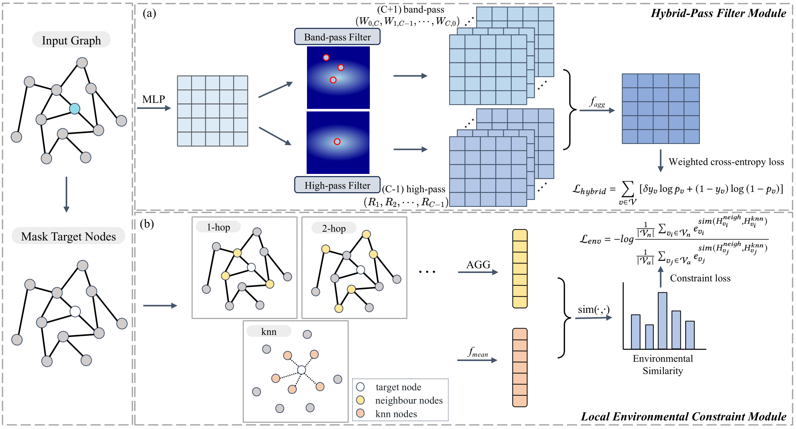








<!-- ================= GLOBAL STYLES ================= -->

<!-- ================= BIO SECTION ================= -->

  
  <!-- 左侧：文字介绍 -->
  

    
Fan Xu

    
Ph.D. Student

    
    

      

        I am currently a first-year Ph.D. student in Computer Science and Technology at Shenzhen Loop Area Institute (SLAI), supervised by <a href="https://scholar.google.com/citations?user=pw_0Z_UAAAAJ&hl=zh-CN&oi=ao">Prof. Wanli Ouyang</a>. Before that, I conducted my Master's studies at University of Science and Technology of China (USTC). My research interests primarily center on foundation models, scientific machine learning, and generative AI.
      

    

    <!-- 链接按钮 -->
    

      <a href="mailto:markxu@mail.ustc.edu.cn" class="link-btn">
        <svg viewBox="0 0 24 24" width="16" height="16" fill="currentColor"><path d="M20 4H4c-1.1 0-1.99.9-1.99 2L2 18c0 1.1.9 2 2 2h16c1.1 0 2-.9 2-2V6c0-1.1-.9-2-2-2zm0 4l-8 5-8-5V6l8 5 8-5v2z"/></svg>
        Email
      </a>
      <a href="https://github.com/Sunxkissed" class="link-btn">
        <svg viewBox="0 0 24 24" width="16" height="16" fill="currentColor"><path d="M20 4H4c-1.1 0-1.99.9-1.99 2L2 18c0 1.1.9 2 2 2h16c1.1 0 2-.9 2-2V6c0-1.1-.9-2-2-2zm0 4l-8 5-8-5V6l8 5 8-5v2z"/></svg>
        Github
      </a> 
      <a href="https://scholar.google.com/citations?user=qfMSkBgAAAAJ&hl=zh-CN" class="link-btn">
        <svg viewBox="0 0 24 24" width="16" height="16" fill="currentColor"><path d="M20 4H4c-1.1 0-1.99.9-1.99 2L2 18c0 1.1.9 2 2 2h16c1.1 0 2-.9 2-2V6c0-1.1-.9-2-2-2zm0 4l-8 5-8-5V6l8 5 8-5v2z"/></svg>
        Google Scholar
      </a>
      
  
    

  
  <!-- 右侧：头像（使用占位图，因原文无头像链接） -->
  
 
    <!-- 提示：请将此处 src 替换为您的头像路径，例如 ../images/avatar.jpg -->
    
  

<!-- ================= NEWS SECTION ================= -->
<h1 class="section-title" id='news'>🔥 News</h1>

  

    <ul>
      <li><strong>2025.11.23</strong>: 1 paper was accepted to KDD2026, Main Track (Research) (First Author).</li>
      <li><strong>2025.11.08</strong>: 2 papers were accepted to AAAI2026, Congrats to All !</li>
      <li><strong>2025.09.18</strong>: 1 paper was accepted to NeurIPS2025 (First Author).</li>
      <li><strong>2025.09.10</strong>: I have joined Shenzhen Loop Area Institute as a Phd student @ SLAI. </li>
      <li><strong>2025.05.01</strong>: 1 paper was accepted to ICML2025, Congrats to Yuan !</li>
      <li><strong>2025.01.22</strong>: 1 paper was accepted to ICLR2025 (Co-First Author).</li>
      <li><strong>2024.09.26</strong>: 1 paper was accepted to NeurIPS2024, Congrats to Hao !</li>
      <li><strong>2024.07.16</strong>: 1 paper was accepted to ACM MM2024 (Co-First Author).</li>
      <li><strong>2023.12.09</strong>: 1 paper was accepted to AAAI2024 (First Author).</li>
    </ul>
  

<!-- ================= SELECTED PUBLICATIONS ================= -->
<h1 class="section-title">🌟 Selected Publications</h1>

<!-- Paper: KDD 2026 HiGO -->

  

    
KDD 2026

    
  

  

    

      <a href="https://openreview.net/forum?id=BZQmpsuW7D&referrer=%5Bthe%20profile%20of%20Fan%20Xu%5D(%2Fprofile%3Fid%3D~Fan_Xu5)">Advanced Global Wildfire Activity Modeling with Hierarchical Graph ODE</a>
    

    

      <strong>Fan Xu</strong>, Wei Gong, Hao Wu, Lilan Peng, Nan Wang, Qingsong Wen, Xian Wu*, Kun Wang, Xibin Zhao*
    

    
(KDD 2026, CCF Rank A)

    
<a href="https://openreview.net/forum?id=ieh9QzG6VO&referrer=%5BAuthor%20Console%5D(%2Fgroup%3Fid%3DKDD.org%2F2026%2FResearch_Track_August%2FAuthors%23your-submissions)">Paper</a>

  

<!-- Paper: AAAI 2026 NeuralOM -->

  

    
AAAI 2026

    
  

  

    

      <a href="https://arxiv.org/abs/2505.21020">NeuralOM: Neural Ocean Model for Subseasonal-to-Seasonal Simulation</a>
    

    

      Yuan Gao†, Hao Wu†‡, <strong>Fan Xu</strong>, Yanfei Xiang, Ruijian Gou, Ruiqi Shu, Qingsong Wen, Xian Wu, Kun Wang*, Xiaomeng Huang*
    

    
(AAAI 2026, CCF Rank A)

    

      <a href="https://arxiv.org/abs/2505.21020">Paper</a>
      <a href="https://github.com/YuanGao-YG/NeuralOM">Code</a>
      
    

  

<!-- Paper: NeurIPS 2025 Breaking -->

  

    
NeurIPS 2025

    
  

  

    

      <a href="https://arxiv.org/abs/2509.17955">Breaking the Discretization Barrier of Continuous Physics Simulation Learning</a>
    

    

      <strong>Fan Xu</strong>, Hao Wu, Nan Wang, Lilan Peng, Kun Wang, Wei Gong, Xibin Zhao*
    

    
(NeurIPS 2025, CCF Rank A)

    
<a href="https://arxiv.org/abs/2509.17955">Paper</a>

  

 

<!-- Paper: ICML 2025 OneForecast -->

  

    
ICML 2025

    
  

  

    

      <a href="https://arxiv.org/abs/2502.00338">OneForecast: A Universal Framework for Global and Regional Weather Forecasting</a>
    

    

      Yuan Gao, Hao Wu, Ruiqi Shu, Huanshuo Dong, <strong>Fan Xu</strong>, Rui Chen, Yibo Yan, Qingsong Wen, Xuming Hu, Kun Wang, Jiahao Wu, Qing Li, Hui Xiong, Xiaomeng Huang*
    

    
(ICML 2025, CCF Rank A)

    
<a href="https://arxiv.org/abs/2502.00338">Paper</a>

  

<!-- Paper: ICLR 2025 Open-CK -->

  

    
ICLR 2025

    
  

  

    

      <a href="https://openreview.net/forum?id=A23C57icJt&referrer=%5Bthe%20profile%20of%20Fan%20Xu%5D(%2Fprofile%3Fid%3D~Fan_Xu5)">Open-CK: The Non-linear Chaotic Combustion Kinetics Benchmark</a>
    

    

      Zaige Fei†, <strong>Fan Xu</strong>†, Junyuan Mao, Yuxuan Liang, Qingsong Wen, Kun Wang, Hao Wu*, Yang Wang*
    

    
(ICLR 2025, THU Rank A)

    
<a href="https://openreview.net/forum?id=mKFFEXeIQS&referrer=%5Bthe%20profile%20of%20Fan%20Xu%5D(%2Fprofile%3Fid%3D~Fan_Xu5)">Paper</a>

  

<!-- Paper: NeurIPS 2024 PURE -->

  

    
NeurIPS 2024

    
  

  

    

      <a href="https://openreview.net/forum?id=z86knmjoUq&referrer=%5Bthe%20profile%20of%20Fan%20Xu%5D(%2Fprofile%3Fid%3D~Fan_Xu5)">PURE: Prompt Evolution with Graph ODE for Out-of-distribution Fluid Dynamics Modeling</a>
    

    

      Hao Wu, Changhu Wang, <strong>Fan Xu</strong>, Jinbao Xue, Chong Chen, Xian-Sheng Hua, Xiao Luo*
    

    
(NeurIPS 2024, CCF Rank A)

    
<a href="https://openreview.net/forum?id=z86knmjoUq&referrer=%5Bthe%20profile%20of%20Fan%20Xu%5D(%2Fprofile%3Fid%3D~Fan_Xu5)">Paper</a>

  

<!-- Paper: ACM MM 2024 PastNet -->

  

    
ACM MM 2024

    
  

  

    

      <a href="https://openreview.net/forum?id=mL0KvSwXzk&referrer=%5Bthe%20profile%20of%20Fan%20Xu%5D(%2Fprofile%3Fid%3D~Fan_Xu5)">PastNet: introducing physical inductive biases for spatio-temporal video prediction</a>
    

    

      Hao Wu†, <strong>Fan Xu</strong>†, Chong Chen, Xian-Sheng Hua, Xiao Luo*, Haixin Wang*
    

    
(ACM MM 2024, CCF Rank A)

    
<a href="https://arxiv.org/abs/2305.11421">Paper</a>

  

<!-- Paper: AAAI 2024 Fraud -->

  

    
AAAI 2024

    
  

  

    

      <a href="https://arxiv.org/abs/2312.06441">Revisiting Graph-based Fraud Detection in Sight of Heterophily and Spectrum</a>
    

    

      <strong>Fan Xu</strong>, Nan Wang*, Hao Wu, Xuezhi Wen, Xibin Zhao*, Hai Wan
    

    
(AAAI 2024, CCF Rank A)

    
<a href="https://arxiv.org/abs/2312.06441">Paper</a>

  

<!-- ================= PRE-PRINT ================= -->
<h1 class="section-title">🌟 Pre-prints</h1>

<!-- Paper: Arxiv Triton -->

  

    
Arxiv 2025

    
  

  

    

      <a href="https://tritoncast4earth.netlify.app/">Advanced Long-term Earth System Forecasting</a>
    

    

      Hao Wu, Yuan Gao, Ruijian Gou, Xian Wu, Chuhan Wu, Huahui Yi, Johannes Brandstetter, Fan Xu, Niklas Boers, Kun Wang, Penghao Zhao, Hao Jia, Qi Song, Xinliang Liu, Juncai He, Shuhao Cao, Huanshuo Dong, Yanfei Xiang, Fan Zhang, Haixin Wang, Xingjian Shi, Qiufeng Wang, Shuaipeng Li, Ruobing Xie, Feng Tao, Yuxu Lu, Yu Guo, Yuntian Chen, Yuxuan Liang, Qingsong Wen, Wanli Ouyang, Deliang Chen, Xiaomeng Huang
    

    

      (Submit to Journal)
    

    

      <a href="https://arxiv.org/abs/2505.19432">Paper</a>
      <a href="https://github.com/Alexander-wu/TritonCast">Code</a>
      <a href="https://huggingface.co/TritonCast">Hugging Face</a>
      <a href="https://tritoncast4earth.netlify.app/">Project Page</a>
    

  

<!-- Paper: Arxiv Unlocking OOD / Spark -->

  

    
Arxiv 2025

    
  

  

    

      <a href="https://arxiv.org/abs/2510.24216">Unlocking Out-of-Distribution Generalization in Dynamics through Physics-Guided Augmentation</a>
    

    

      <strong>Fan Xu</strong>, Wei Gong, Hao Wu, Nan Wang, Qingsong Wen, Kun Wang, Xian Wu, Xibin Zhao*
    

    
(Arxiv 2025)

    
<a href="https://arxiv.org/abs/2510.24216">Paper</a>

  

<!-- ================= MISC SECTIONS ================= -->
<h1 class="section-title">🎖 Honors and Awards</h1>

  <ul style="line-height: 1.6; padding-left: 20px;">
    <li><em>2022, 2024, 2025</em>, First-class Academic Scholarship of the University of Science and Technology of China.</li>
    <li><em>2022.11</em>, China Collegiate Computing Competition - Intelligent Interaction Innovation Contest, National Finals Second Prize.</li>
    <li><em>2022.06</em>, HarmonyOS Developer Competition - Global Campus AI Algorithm Elite Track, Star Excellence Award (7/1000+).</li>
  </ul>

<h1 class="section-title">💻 Academic Service</h1>

  <strong>Conference Reviewer / PC Member:</strong> 
  ACM MM (2024), KDD (2025), ICLR (2025, 2026), NeurIPS (2025), AAAI (2026), CVPR (2026).

<!-- Map -->

    

<!-- 
      

        Please feel free to contact me for communication and collaboration.
      

<h1 class="section-title">💬 Invited Talks</h1>

  <ul style="line-height: 1.6; padding-left: 20px;">
    <li><em>2024.08</em>, Review of Anomaly Detection Applications and Outlook for Extreme Event Forecasting. @ Tsinghua University</li>
  </ul>

-->

