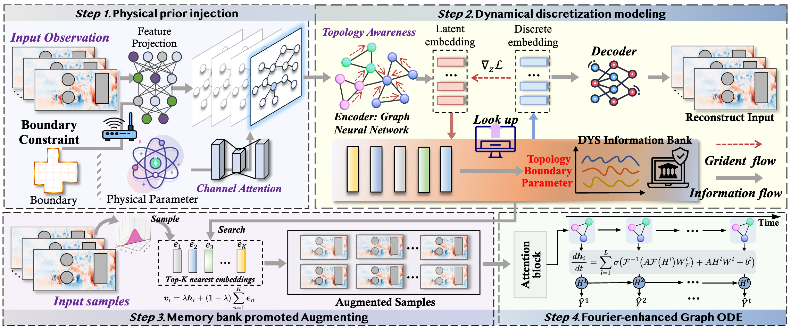
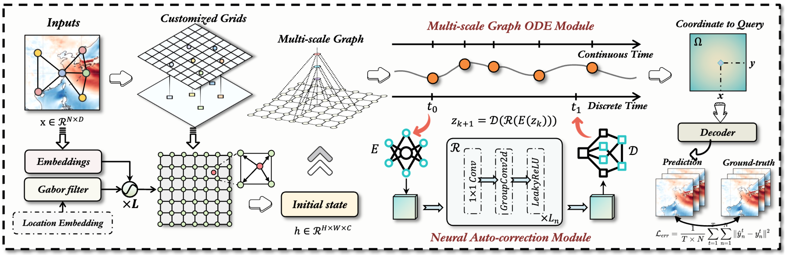








I am currently a first-year Ph.D. student at Shenzhen Loop Area Institute (SLAI), supervised by [Prof. Wanli Ouyang](https://scholar.google.com/citations?user=pw_0Z_UAAAAJ&hl=zh-CN&oi=ao). Before that, I conducted my Master's studies at USTC. My research interest mainly includes foundation models, scientific machine learning, and world models.

Please feel free to contact me for communication and collaboration.

**Email**: <u>markxu@mail.ustc.edu.cn</u> or <u>fanxu@slai.edu.cn</u> &nbsp; &nbsp;  **Wechat**: Markxu_0111

<h1 id='news'>🔥 News</h1>

  <ul>
    <li><strong>2025.11.08</strong>: 2 paper were accepted to AAAI2026, Congrats to All !</li>
    <li><strong>2025.09.18</strong>: 1 paper was accepted to NeurIPS2025 (First Author).</li>
    <li><strong>2025.09.10</strong>: I have joined Shenzhen Loop Area Institute as a Phd student @ SLAI. </li>
    <li><strong>2025.05.01</strong>: 1 paper was accepted to ICML2025.</li>
    <li><strong>2025.01.22</strong>: 1 paper was accepted to ICLR2025 (Co-First Author).</li>
    <li><strong>2024.09.26</strong>: 1 paper was accepted to NeurIPS2024.</li>
    <li><strong>2024.07.16</strong>: 1 paper was accepted to ACM MM2024 (Co-First Author).</li>
    <li><strong>2024.05.27</strong>: 1 paper was accepted to ECML2024 (First Author).</li>
    <li><strong>2023.12.09</strong>: 1 paper was accepted to AAAI2024 (First Author).</li>
  </ul>

# 📝 Publications 

#### AI for Science
- ``NeurIPS 2025`` [Breaking the Discretization Barrier of Continuous Physics Simulation Learning](https://arxiv.org/abs/2509.17955). **Fan Xu**, Hao Wu, Nan Wang, Lilan Peng, Kun Wang, Wei Gong, Xibin Zhao*
- ``ACM MM 2024`` [PastNet: introducing physical inductive biases for spatio-temporal video prediction](https://openreview.net/forum?id=mL0KvSwXzk&referrer=%5Bthe%20profile%20of%20Fan%20Xu%5D(%2Fprofile%3Fid%3D~Fan_Xu5)).Hao Wu†, **Fan Xu**†, Chong Chen, Xian-Sheng Hua, Xiao Luo*, Haixin Wang*
- ``ICLR 2025`` [Open-CK: The Non-linear Chaotic Combustion Kinetics Benchmark](https://openreview.net/forum?id=A23C57icJt&referrer=%5Bthe%20profile%20of%20Fan%20Xu%5D(%2Fprofile%3Fid%3D~Fan_Xu5)). Zaige Fei†, **Fan Xu**†, Junyuan Mao, Yuxuan Liang, Qingsong Wen, Kun Wang, Hao Wu*, Yang Wang*
- ``NeurIPS 2024`` [PURE: Prompt Evolution with Graph ODE for Out-of-distribution Fluid Dynamics Modeling](https://openreview.net/forum?id=z86knmjoUq&referrer=%5Bthe%20profile%20of%20Fan%20Xu%5D(%2Fprofile%3Fid%3D~Fan_Xu5)). Hao Wu, Changhu Wang, **Fan Xu**, Jinbao Xue, Chong Chen, Xian-Sheng Hua, Xiao Luo*
- ``ICML 2025`` [OneForecast: A Universal Framework for Global and Regional Weather Forecasting](https://arxiv.org/abs/2502.00338). Yuan Gao, Hao Wu, Ruiqi Shu, Huanshuo Dong, **Fan Xu**, Rui Chen, Yibo Yan, Qingsong Wen, Xuming Hu, Kun Wang, Jiahao Wu, Qing Li, Hui Xiong, Xiaomeng Huang*
- ``AAAI 2026`` [NeuralOM: Neural Ocean Model for Subseasonal-to-Seasonal Simulation](https://arxiv.org/abs/2505.21020). Yuan Gao, Ruiqi Shu, Hao Wu, **Fan Xu**, Yanfei Xiang, Ruijian Gou, Qingsong Wen, Xian Wu, Kun Wang, Xiaomeng Huang*
- ``Arxiv`` [Advanced Global Wildfire Activity Modeling with Hierarchical Graph ODE](https://openreview.net/forum?id=BZQmpsuW7D&referrer=%5Bthe%20profile%20of%20Fan%20Xu%5D(%2Fprofile%3Fid%3D~Fan_Xu5)). **Fan Xu**, Wei Gong, Hao Wu, Nan Wang, Qingsong Wen, Xian Wu, Kun Wang, Xibin Zhao*
- ``Arxiv`` [Unlocking Out-of-Distribution Generalization in Dynamics through Physics-Guided Augmentation](https://arxiv.org/abs/2510.24216). **Fan Xu**, Wei Gong, Hao Wu, Nan Wang, Qingsong Wen, Kun Wang, Xian Wu, Xibin Zha*
- ``Arxiv`` [Advanced long-term earth system forecasting by learning the small-scale nature](https://arxiv.org/abs/2505.19432). Hao Wu†, Yuan Gao†, Ruiqi Shu†, Kun Wang†, Ruijian Gou†, Chuhan Wu†, Xinliang Liu, Juncai He, Shuhao Cao, Junfeng Fang, Xingjian Shi, Feng Tao, Qi Song, Shengxuan Ji, Yanfei Xiang, Yuze Sun, Jiahao Li, **Fan Xu**, Huanshuo Dong, Haixin Wang, Fan Zhang, Penghao Zhao, Xian Wu, Qingsong Wen, Deliang Chen, Xiaomeng Huang*
- ``Arxiv`` [Turb-L1: Achieving Long-term Turbulence Tracing By Tackling Spectral Bias](https://arxiv.org/abs/2505.19038). Hao Wu†, Yuan Gao†, Ruiqi Shu†, Zean Han, **Fan Xu**, Zhihong Zhu, Qingsong Wen, Xian Wu, Kun Wang*, Xiaomeng Huang*

#### Graph Representation Learning and Anomaly Detection
- ``AAAI 2024`` [Revisiting Graph-based Fraud Detection in Sight of Heterophily and Spectrum](https://arxiv.org/abs/2312.06441). **Fan Xu**, Nan Wang*, Hao Wu, Xuezhi Wen, Xibin Zhao*, Hai Wan
- ``ECML PKDD 2024`` [GLADformer: A Mixed Perspective for Graph-level Anomaly Detection](https://arxiv.org/abs/2406.00734). **Fan Xu**, Nan Wang*, Hao Wu, Xuezhi Wen, Dalin Zhang, Siyang Lu, Binyong Li, Wei Gong, Hai Wan, Xibin Zhao*
- ``FCS 2024`` [Advanced Persistent Threat Detection via Mining Long-Term Features in Provenance Graphs](https://scholar.google.com/citations?view_op=view_citation&hl=en&user=HdXMhfcAAAAJ&citation_for_view=HdXMhfcAAAAJ:IWHjjKOFINEC). **Fan Xu**, Qinxin Zhao, Xiaoxiao Liu, Nan Wang*, Meiqi Gao, Xuezhi Wen, Dalin Zhang
- ``IEEE ICPADS 2023`` [Few-shot Message-Enhanced Contrastive Learning for Graph Anomaly Detection](https://arxiv.org/abs/2311.10370). **Fan Xu**, Nan Wang*, Xuezhi Wen, Meiqi Gao, Chaoqun Guo, Xibin Zhao*
- ``IEEE SMC 2023`` [Exploring Global and Local Information for Anomaly Detection with Normal Samples](https://arxiv.org/abs/2306.02025). **Fan Xu**, Nan Wang*, Xibin Zhao*

# 🎖 Honors and Awards
- *2022, 2024, 2025* First-class Academic Scholarship of the University of Science and Technology of China.
- *2022.11* China Collegiate Computing Competition - Intelligent Interaction Innovation Contest, National Finals Second Prize
- *2022.06* HarmonyOS Developer Competition - Global Campus AI Algorithm Elite Track, Star Excellence Award (7/1000+)

# 🐣 Invited Talks
- *2024.08*, Review of Anomaly Detection Applications and Outlook for Extreme Event Forecasting. @ Tsinghua University

# 💻 Academic service
- Conference Reviewer: ACM MM 2024 Conference Reviewers, KDD 2025 Conference Reviewers, ICLR 2025 Conference Reviewers, NeurIPS 2025 Conference Reviewers, AAAI 2026 Conference Program Committee, ICLR 2026 Conference Reviewers, CVPR 2026 Conference Reviewers

# 📖 Selected Publications

 

[Advanced Global Wildfire Activity Modeling with Hierarchical Graph ODE](https://openreview.net/forum?id=ieh9QzG6VO&referrer=%5BAuthor%20Console%5D(%2Fgroup%3Fid%3DKDD.org%2F2026%2FResearch_Track_August%2FAuthors%23your-submissions))

**Fan Xu**, Wei Gong, Hao Wu, Nan Wang, Qingsong Wen, Xian Wu, Kun Wang, Xibin Zhao*

---

 

[Unlocking Out-of-Distribution Generalization in Dynamics through Physics-Guided Augmentation](https://arxiv.org/abs/2510.24216)

**Fan Xu**, Wei Gong, Hao Wu, Nan Wang, Qingsong Wen, Kun Wang, Xian Wu, Xibin Zha*

---

NeurIPS 2025

[Breaking the Discretization Barrier of Continuous Physics Simulation Learning](https://arxiv.org/abs/2509.17955)

**Fan Xu**, Hao Wu, Nan Wang, Lilan Peng, Kun Wang, Wei Gong, Xibin Zhao*

*NeurIPS, 2025* 

---

 

[Advanced long-term earth system forecasting by learning the small-scale nature](https://arxiv.org/abs/2505.19432)

Hao Wu†, Yuan Gao†, Ruiqi Shu†, Kun Wang†, Ruijian Gou†, Chuhan Wu†, Xinliang Liu, Juncai He, Shuhao Cao, Junfeng Fang, Xingjian Shi, Feng Tao, Qi Song, Shengxuan Ji, Yanfei Xiang, Yuze Sun, Jiahao Li, **Fan Xu**, Huanshuo Dong, Haixin Wang, Fan Zhang, Penghao Zhao, Xian Wu, Qingsong Wen, Deliang Chen, Xiaomeng Huang*

---

 

[Turb-L1: Achieving Long-term Turbulence Tracing By Tackling Spectral Bias](https://arxiv.org/abs/2505.19038). 

Hao Wu†, Yuan Gao†, Ruiqi Shu†, Zean Han, **Fan Xu**, Zhihong Zhu, Qingsong Wen, Xian Wu, Kun Wang*, Xiaomeng Huang*

---

ICML 2025

[OneForecast: A Universal Framework for Global and Regional Weather Forecasting](https://arxiv.org/abs/2502.00338)

Yuan Gao†, Hao Wu†, Ruiqi Shu†, Huanshuo Dong, **Fan Xu**, Rui Chen, Yibo Yan, Qingsong Wen, Xuming Hu, Kun Wang, Jiahao Wu, Qing Li, Hui Xiong, Xiaomeng Huang*

*ICML, 2025* 

---

ACM MM 2024

[PastNet: introducing physical inductive biases for spatio-temporal video prediction](https://arxiv.org/abs/2305.11421)

Hao Wu†, **Fan Xu**†, Chong Chen, Xian-Sheng Hua, Xiao Luo*, Haixin Wang*

*ACM MM, 2024*  

---

ICLR 2025

[Open-CK: The Non-linear Chaotic Combustion Kinetics Benchmark](https://openreview.net/forum?id=mKFFEXeIQS&referrer=%5Bthe%20profile%20of%20Fan%20Xu%5D(%2Fprofile%3Fid%3D~Fan_Xu5))

Zaige Fei†, **Fan Xu**†, Junyuan Mao, Yuxuan Liang, Qingsong Wen, Kun Wang, Hao Wu*, Yang Wang*

*ICLR, 2025* 

---

[PURE: Prompt Evolution with Graph ODE for Out-of-distribution Fluid Dynamics Modeling](https://openreview.net/forum?id=z86knmjoUq&referrer=%5Bthe%20profile%20of%20Fan%20Xu%5D(%2Fprofile%3Fid%3D~Fan_Xu5))

Hao Wu, Changhu Wang, **Fan Xu**, Jinbao Xue, Chong Chen, Xian-Sheng Hua, Xiao Luo*

*NeurIPS, 2024* 

---

 

[Learning Counterfactual-Invariant Representations for Robust Time Series Anomaly Detection](https://openreview.net/forum?id=YYRAWFOlk7&referrer=%5BAuthor%20Console%5D(%2Fgroup%3Fid%3DAAAI.org%2F2026%2FConference%2FAuthors%23your-submissions))

**Fan Xu**, Nan Wang, Hao Wu, Cheng Yan, Hai Wan, Wei Gong, Hairong Dong, Xibin Zhao*

---

ECML-PKDD 2024

[GLADformer: A Mixed Perspective for Graph-level Anomaly Detection](https://arxiv.org/abs/2406.00734)

**Fan Xu**, Nan Wang*, Hao Wu, Xuezhi Wen, Dalin Zhang, Siyang Lu, Binyong Li, Wei Gong, Hai Wan, Xibin Zhao*

*ECML PKDD, 2024*  

---

AAAI 2024

[Revisiting Graph-based Fraud Detection in Sight of Heterophily and Spectrum](https://arxiv.org/abs/2312.06441)

**Fan Xu**, Nan Wang*, Hao Wu, Xuezhi Wen, Xibin Zhao*, Hai Wan

*AAAI, 2024*  

    

<!--

---
permalink: /
title: ""
excerpt: ""
author_profile: true
redirect_from: 
  - /about/
  - /about.html
---

I am Fan Xu, a first-year Ph.D. student trained by the University of Science and Technology of China (USTC), specializing in Computer Science and Technology. Before that, I finished my Master's studies at USTC. My research interest mainly includes foundation models, scientific machine learning, and world models. Feel free to contact me for communication and collaboration.

I am currently a first-year Ph.D. student at the University of Science and Technology of China (USTC), specializing in Computer Science and Technology. Before that, I conducted my Master's studies at USTC. My research interest mainly includes foundation models, scientific machine learning, and world models.

I am currently a first-year Ph.D. student at the University of Science and Technology of China (USTC), specializing in Computer Science and Technology. Before that, I finished my Master's studies at USTC. My research interest mainly includes foundation models, scientific machine learning, and world models. Feel free to contact me for communication and collaboration.

I am Fan Xu, currently a second-year Master's student in Computer Science and Technology, University of Science and Technology of China (USTC). Before that, I received my bachelor degree in Dalian Universuty of Technology in 2022. My research interest includes AI4Science, graph representation learning, anomaly detection, and large language model. Feel free to contact me for communication and collaboration!

I am currently a first-year Ph.D. student at Shenzhen Loop Area Institute (SLAI), supervised by [Prof. Wanli Ouyang](https://scholar.google.com/citations?user=pw_0Z_UAAAAJ&hl=zh-CN&oi=ao). Before that, I conducted my Master's studies at USTC. My research interest mainly includes foundation models, scientific machine learning, and world models.

Please feel free to contact me for communication and collaboration.

**Email**: <u>markxu@mail.ustc.edu.cn</u> or <u>fanxu@slai.edu.cn</u> &nbsp; &nbsp;  **Wechat**: Markxu_0111

My research interests are as follows:

* **Scientific Machine Learning**: I focus on bridging the gap between traditional numerical methods and modern deep learning. The objective is to overcome the limitations of both: the high computational cost of high-fidelity simulations and the physical inconsistency of purely data-driven models. My research aims to accelerate complex simulations and enable robust predictions from sparse or noisy data, paving the way for advancements in areas like fluid dynamics and climate modeling.

* **Large Language Model Reasoning**: I focus on moving beyond pattern generation to realize efficient reasoning in Large Language Models. This involves investigating the cognitive mechanisms of LLMs, exploring their intrinsic thought patterns to improve how they tackle complex problems. Crucially, a parallel focus is addressing the fundamental challenges of safety and hallucination in both Large Language Models (LLMs) and Multimodal Large Language Models (MLLMs). 

# 🔥 News
- *2025.09*: &nbsp;🎉🎉 One paper was accepted by NeurIPS 2025 (First Author).
- *2025.05*: &nbsp;🎉🎉 One paper was accepted by ICML 2025.
- *2025.01*: &nbsp;🎉🎉 One paper was accepted by ICLR 2025 (Co-First Author).
- *2024.09*: &nbsp;🎉🎉 One paper was accepted by NeurIPS 2024.
- *2024.08*: &nbsp;🎉🎉 One paper was accepted by FCS 2024 (First Author).
- *2024.07*: &nbsp;🎉🎉 One paper was accepted by ACM MM 2024 (Co-First Author).
- *2024.05*: &nbsp;🎉🎉 One paper was accepted by ECML PKDD 2024 (First Author).
- *2023.12*: &nbsp;🎉🎉 One paper was accepted by AAAI 2024 (First Author).
- *2023.10*: &nbsp;🎉🎉 One paper was accepted by IEEE ICPADS 2023 (First Author).
- *2023.06*: &nbsp;🎉🎉 One paper was accepted by IEEE SMC 2023 (First Author).

- ``ACM MM 2024`` [PastNet: introducing physical inductive biases for spatio-temporal video prediction](https://openreview.net/forum?id=mL0KvSwXzk&referrer=%5Bthe%20profile%20of%20Fan%20Xu%5D(%2Fprofile%3Fid%3D~Fan_Xu5)).**Hao Wu**, **Fan Xu**, Chong Chen, Xian-Sheng Hua, Xiao Luo#, Haixin Wang#

- ``ACM MM 2024`` [PastNet: introducing physical inductive biases for spatio-temporal video prediction](https://openreview.net/forum?id=mL0KvSwXzk&referrer=%5Bthe%20profile%20of%20Fan%20Xu%5D(%2Fprofile%3Fid%3D~Fan_Xu5)).**Hao Wu**, **Fan Xu**, Chong Chen, Xian-Sheng Hua, Xiao Luo#, Haixin Wang#

- ``Arxiv`` [PastNet: introducing physical inductive biases for spatio-temporal video prediction](https://arxiv.org/abs/2305.11421).Hao Wu, Wei Xiong, Fan Xu, Xiao Luo#, Chong Chen, Xian-Sheng Hua, Haixin Wang#. Arxiv, 2024.

I am adept at developing various deep learning algorithms using PyTorch. Specifically, I am proficient in various applications of Graph Neural Networks, including node-level, edge-level, graph-level, and spatio-temporal graph modeling. Additionally, I have successfully reproduced models such as FourCastNet, GraphCast and MeshGraphNet.

- *2024.0826*: &nbsp; One paper was accepted by FCS 2024 (First Author).
- *2024.0716*: &nbsp; One paper was accepted by ACM MM 2024 (Co-First Author).
- *2024.0527*: &nbsp; One paper was accepted by ECML PKDD 2024 (First Author).
- *2023.1209*: &nbsp; One paper was accepted by AAAI 2024 (First Author).
- *2023.1027*: &nbsp; One paper was accepted by IEEE ICPADS 2023 (First Author).
- *2023.0601*: &nbsp; One paper was accepted by IEEE SMC 2023 (First Author).

I am Fan Xu, currently a third-year Master’s student in Computer Science and Technology, University of Science and Technology of China (USTC). Before that, I received my bachelor degree in Dalian Universuty of Technology in 2022. My research interests are as follows:

# 💬 Project Skills
I am adept at developing various deep learning algorithms using PyTorch. Specifically, I am proficient in various applications of graph neural networks and spatio-temporal architectures. Also, I am highly interested in diverse neural operators for fluid dynamics modeling.

- *2024.04*, Application and Research of Diffusion model within Timeseries Anomaly Detection. @ Beijing Jiaotong University

#### AI for Science
- ``NeurIPS 2024`` [PURE: Prompt Evolution with Graph ODE for Out-of-distribution Fluid Dynamics Modeling](https://openreview.net/forum?id=z86knmjoUq&referrer=%5Bthe%20profile%20of%20Fan%20Xu%5D(%2Fprofile%3Fid%3D~Fan_Xu5)). Hao Wu, Changhu Wang, Fan Xu, Jinbao Xue, Chong Chen, Xian-Sheng Hua, Xiao Luo
- ``Arxiv`` [Open-CK: The Non-linear Chaotic Combustion Kinetics Benchmark](https://openreview.net/forum?id=A23C57icJt&referrer=%5Bthe%20profile%20of%20Fan%20Xu%5D(%2Fprofile%3Fid%3D~Fan_Xu5)). **Zaige Fei**, **Fan Xu**, Junyuan Mao, Yuxuan Liang, Qingsong Wen, Kun Wang, Hao Wu#, Yang Wang#
- ``Arxiv`` [SPARK: Physics-Guided Quantitative Augmentation for Dynamical System Modeling](https://openreview.net/forum?id=BZQmpsuW7D&referrer=%5Bthe%20profile%20of%20Fan%20Xu%5D(%2Fprofile%3Fid%3D~Fan_Xu5)). **Fan Xu**, Penghao Zhao, Zhipeng Xu, Xinliang Zhou, Xinping Yi, Qingsong Wen, Hao Wu#, Kun Wang#.
- ``Arxiv`` [Leveraging Lie Point Symmetries and Causal Inference for Enhanced Neural PDE Solvers](https://openreview.net/forum?id=WkVxfNdIPk&referrer=%5Bthe%20profile%20of%20Fan%20Xu%5D(%2Fprofile%3Fid%3D~Fan_Xu5)). Cheng Yan, Ziwei Niu, WangZihao, Penghao Zhao, Kun Wang, Fan Xu#, Hao Wu#
- ``Arxiv`` [P-Align: Self-Alignment in Physical Dynamic System Modeling](https://openreview.net/forum?id=AgTSjXh7vl&referrer=%5Bthe%20profile%20of%20Fan%20Xu%5D(%2Fprofile%3Fid%3D~Fan_Xu5)). Zhipeng Xu, Fan Xu, Hanbin Wang, Xinliang Xin, Lilan Peng, Qingsong Wen, Kun Wang#, Hao Wu#
- ``Arxiv`` [SOCST: Learning Continuous Physics Simulation Overcoming Discretization from Partial Observations](https://openreview.net/forum?id=6qeHCZljCq&referrer=%5Bthe%20profile%20of%20Fan%20Xu%5D(%2Fprofile%3Fid%3D~Fan_Xu5)). **Fan Xu**, Cheng Yan, Hao Wu

#### Spatio-temporal Prediction
- ``ACM MM 2024`` [PastNet: introducing physical inductive biases for spatio-temporal video prediction](https://openreview.net/forum?id=mL0KvSwXzk&referrer=%5Bthe%20profile%20of%20Fan%20Xu%5D(%2Fprofile%3Fid%3D~Fan_Xu5)).**Hao Wu**, **Fan Xu**, Chong Chen, Xian-Sheng Hua, Xiao Luo#, Haixin Wang#
- ``Arxiv`` [Earthfarseer-V2: A Versatile All-in-One Model for Learning Complex Spatio-Temporal Dynamics](https://scholar.google.com/citations?view_op=view_citation&hl=en&user=HdXMhfcAAAAJ&citation_for_view=HdXMhfcAAAAJ:IWHjjKOFINEC). Hao Wu, Junfeng Fang, Yuxuan Liang, Guibin Zhang, Fan Xu, Wei Xiong, Qingsong Wen, Yu Zheng, Kun Wang#. Submitted to TPAMI.
- ``Arxiv`` [Spatio-temporal Twins with A Cache for Modeling Long-term System Dynamics](https://openreview.net/forum?id=aE6HazMgRz&referrer=%5BAuthor%20Console%5D(%2Fgroup%3Fid%3DICLR.cc%2F2024%2FConference%2FAuthors%23your-submissions)). Hao Wu, Kun Wang, Fan Xu, Yue Li, Xu Wang, Weiyan Wang, Haixin Wang, Xiao Luo#
- ``Arxiv`` [Spatio-temporal fluid dynamics modeling via physical-awareness and parameter diffusion guidance](https://arxiv.org/abs/2403.13850). **Hao Wu**, **Fan Xu**, Yifan Duan, Ziwei Niu, Weiyan Wang, Gaofeng Lu, Kun Wang, Yuxuan Liang#, Yang Wang#

[Leveraging Lie Point Symmetries and Causal Inference for Enhanced Neural PDE Solvers](https://openreview.net/forum?id=MGNsP0LGte&referrer=%5Bthe%20profile%20of%20Fan%20Xu%5D(%2Fprofile%3Fid%3D~Fan_Xu5))

Cheng Yan, Ziwei Niu, WangZihao, Penghao Zhao, Kun Wang, Fan Xu#, Hao Wu#

---

[Reinforced Causal Discovery of Multivariate Time Series Anomaly Detection](https://openreview.net/forum?id=MGNsP0LGte&referrer=%5Bthe%20profile%20of%20Fan%20Xu%5D(%2Fprofile%3Fid%3D~Fan_Xu5))

**Fan Xu**, Nan Wang#, Hao Wu, Xuezhi Wen, Binyong Li, Hai Wan, Xibin Zhao#

---

[SOCST: Learning Continuous Physics Simulation Overcoming Discretization from Partial Observations](https://openreview.net/forum?id=MGNsP0LGte&referrer=%5Bthe%20profile%20of%20Fan%20Xu%5D(%2Fprofile%3Fid%3D~Fan_Xu5))

**Fan Xu**, Cheng Yan, Penghao Zhao, Hao Wu, Kun Wang#, Yang Wang#

---

#  💻 Research Experience

  
  <ul style="list-style-type: disc; padding-left: 20px;">
    <li style="list-style-type: none;">Data Intelligence Research Center, Suzhou Institute for Advanced Research, USTC</li>
    <li style="list-style-type: none;"><em>2023.09 - 2024.06</em>, <strong>Remote Internship</strong></li>
    <li style="list-style-type: none;">mentored by Kun Wang and Yang Wang</li>
  </ul>

  
  <ul style="list-style-type: disc; padding-left: 20px;">
    <li style="list-style-type: none;">Keen Security Lab, Tencent Technology (Shenzhen)</li>
    <li style="list-style-type: none;"><em>2022.04 - 2023.05</em>, <strong>Remote Internship</strong></li>
    <li style="list-style-type: none;">mentored by Mengxia Luo and Nan Wang</li>
  </ul>

# 🎖 Honors and Awards
- *2023.10* Outstanding Graduate Student Award of Zhejiang University (Top 20%).
- *2021.02* Outstanding Undergraduate Award (Top 5%).
- *2020.10* National Scholarship, highest scholarship from Ministry of Education of China (Top 1%).
- *2020.03* Provincial Hundred-excellent College Student Award (Top 1%). 

# 📖 Educations
- *2021.09 - present*, Ph.D student, Zhejiang University, Hangzhou. 
- *2017.09 - 2021.06*, Undergraduate, Anhui Agricultural University, Hefei. 

# 💬 Invited Talks
- *2021.06*, Lorem ipsum dolor sit amet, consectetur adipiscing elit. Vivamus ornare aliquet ipsum, ac tempus justo dapibus sit amet. 
- *2021.03*, Lorem ipsum dolor sit amet, consectetur adipiscing elit. Vivamus ornare aliquet ipsum, ac tempus justo dapibus sit amet.  \| [\[video\]](https://github.com/)

# 💻 Internships
- *2019.05 - 2020.02*, [Lorem](https://github.com/), China.
-->
